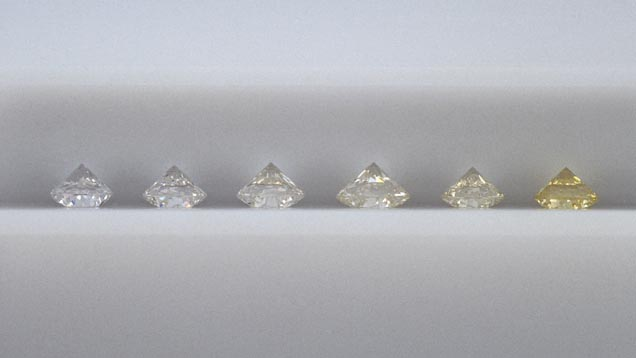
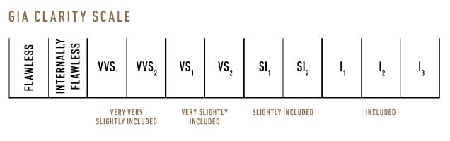

```{r setup, include=FALSE}
knitr::opts_chunk$set(echo = TRUE)
```

# Executive Summary

While kings and queens of the past preferred emeralds, sapphires and rubies, the modern stone of glamour is the diamond. They are valued for their perceived rarity, for their timelessness, and for the stories that can be told about them.^[1] At the diamond dealer, we are told to look for value in the Four C's -- carat, cut, color, and clarity.^[2] To make sense of these factors and how they affect the price of a diamond, we analyzed data from the world's leading online diamond dealer, Blue Nile. Prices varying from \$229 to over $2.3 million were best modeled using all features available in the data set using multiple linear regression. The model accounts for 98%  of price variation, and has higher confidence for lower prices than the higher prices. Large, expensive diamonds, which are usually natural rather than lab-grown, may have extra price variation due to their immeasurable qualities like legacy, history, rarity, and glamour.

# Analysis Method

The Blue Nile Diamond data set contains the price, carat, cut, color, and clarity of over 210,000 diamonds for sale on their website at the time the data was gathered. Prices for these diamonds vary widely from \$229 to over \$2.3 million, and the average price is \$5540. We wanted to investigate the effect that the Four C's have on diamond prices and how well these characteristics alone determine the price. After all, there should be some value that this data does not account for like lab-grown versus natural, or the more ethereal quality of each diamond's unique history. If we use this data set to create a price prediction model, how confident can we be that the model is correct for diamonds in general? And what is the estimated margin of error if we use it to predict the price of a diamond found at our local jeweler?

To answer these questions, we started by examining the relationship between price and each of carat, cut, color, and clarity alone. We found that carat, the physical weight of the diamond, had a strong influence on diamond price. Estimating price based on carat alone accounted for 56% of the variability in price between the diamonds in Blue Nile's data. This makes sense as much of the high price that diamonds carry is due to their limited supply, and larger stones are more rare. One interesting observation is that carat weights that are round numbers seem to be more common. Similar to how a customer buying a car might find it easier to stomach paying \$4999 rather than \$5000 even though the price is virtually the same --  diamond buyers likely perceive a 2 carat diamond as much better than a 1.9 carat diamond. It appears that gemologists are sizing their diamonds with this marketing in mind.

Next, we investigated how a combination of the Four C's related to price. With all these factors combined, we were able to account for 98% of the price variation observed in this data set. We also proved that each diamond characteristic in the data is useful to keep in the model; none could be disregarded without a significant impact on the predictive ability of the model.

Finally, we checked to see if any interaction among diamond qualities had a significant effect on price. 

To show the predictive power of the model we developed during this analysis, we took two diamonds of different price levels as examples. From the high price tier, we have a 9.09 carat diamond with VS2 clarity, I color, Ideal cut, and a price of \$258,497. Then we looked at a lower priced $3851 stone weighing 1.1 carat with VS1 clarity, I color, Very Good cut. In our initial glance at this data, we noticed that prices for high priced, large carat stones vary a lot more than prices for less expensive, smaller stones. This is again evident from predicting prices for our two sample diamonds. 


# Exploratory Data Analysis

```{r, include=FALSE}
# Load data set
diamonds <- read.csv('diamond_data.csv', header=TRUE)

# Randomly shuffle rows
diamonds <- diamonds[sample(nrow(diamonds)),]
attach(diamonds)

#names(diamonds)
#head(diamonds)
summary(diamonds)
```

As downloaded from Blue Nile, our data set was clean with consistent formatting and no missing values. The data contained 210,638 rows in 5 columns. Two columns were numeric -- *price* of the diamonds in dollars and *carat* weight. Three other categorical columns were present -- *color*, *clarity*, and *cut*. These are industry standard ratings with alphanumeric designations.

```{r, include=FALSE}
summary(diamonds$price)
sd(diamonds$price)
```

Price is our response variable of interest. Diamond price values ranged from \$229 to over \$2.3 million with an average of \$5540, a median of \$1432, and a standard deviation of $22,898. This data does not appear to be normally distributed. Our mean is much smaller than the standard deviation, indicating that the data are spread away from the mean. We can also tell by the median and mean that our data has a positive skew with a long tail on the right. Two histograms of price are shown below -- the first with linear scale for the price axis and the second with logarithmic scale for the price axis. Plotting price on a logarithmic scale is necessary to see the data clearly, and we repeat this procedure in all the graphs to follow.

```{r, echo=FALSE}
par(mfrow=c(1,2))
hist(diamonds$price, xlab = "", main="Histogram of Price ($)")
h <- hist(log(diamonds$price), xaxt = "n", xlab = "", main="Histogram of Price ($), ln scale")
axis(1, at = log(c(250, 2500, 25000, 250000, 2000000)), labels = format(c(250, 2500, 25000, 250000, 2000000), digits=0, scientific=FALSE), las=2)
```

The carat unit of measure describes the weight of a diamond with extreme precision. One carat is the weight of a single paperclip, and diamonds are usually weighed to the one-thousandth of one carat.^[2] This precision is extremely important because a diamond's price per carat is typically very high, and errors in measurement can have a high cost. Our data appears to be rounded to the nearest hundredth of a carat. A quick scatterplot of price versus carat weight appears to show a strong positive relationship between the two. We also calculated a high, positive coefficient of correlation value of 0.752.

```{r, echo=FALSE}
plot(diamonds$price~diamonds$carat, main="Weight vs. Price", xlab="Weight (carat)", ylab="Price (USD)")
```
```{r, include=FALSE}
round(cor(diamonds[,c(5,1)]),3)
```

```{r, include=FALSE}
# Bin colors and Dummy Code Variables
diamonds$color_cat [diamonds$color %in% c("D", "E", "F")] <- 'Colorless'
diamonds$color_cat [diamonds$color %in% c("G", "H", "I", "J")] <- 'Near Colorless'
diamonds$color_cat <- factor(diamonds$color_cat)
levels(diamonds$color_cat) <- c("Colorless", "Near Colorless")
contrasts(diamonds$color_cat)

diamonds$clarity <- factor(diamonds$clarity)
levels(diamonds$clarity) <- c('FL', 'IF', 'VVS1','VVS2','VS1','VS2', 'SI1','SI2','SI3','I1', 'I2','I3')
relevel(diamonds$clarity, ref = "I3")
contrasts(diamonds$clarity)

diamonds$cut <- factor(diamonds$cut)
levels(diamonds$cut) <- c('Astor Ideal', 'Ideal', 'Very Good','Good')
relevel(diamonds$cut, ref = "Good")
contrasts(diamonds$cut)
```

Color rates a diamond's hue on a scale from colorless to light yellow. Designations on this scale are alphabetically ordered letters from D (colorless) to Z (light yellow). The figure below shows what diamonds on this scale look like. Ratings closer to D (colorless) are generally preferred by buyers. The ideal, structurally perfect diamond crystal would be a colorless stone, and more color can give the diamond a cloudy appearance in certain light.


*Source: GIA [https://www.gia.edu/images/19146.jpg]*


In a boxplot of color and price, we can see that some of the highest prices are observed in the D (colorless) rating. However, there does not seem to be a clear increase or decrease in mean price as color rating improves.

```{r, echo=FALSE}
boxplot(diamonds$price~diamonds$color, main="Color vs. Price Boxplot", xlab="Color", ylab="Price (USD)", log = "y")
```
A flawless lab-grown diamond crystal would be perfectly clear, but diamonds formed in nature and imperfect lab conditions contain imperfections. Inclusions are the name given to imperfections within the diamond, and flaws on the surface are called blemishes.^[2] These imperfections bend light reflecting through the diamond and decrease its clarity. Clarity is measured on a scale of 11 ratings from FL (Flawless) to I3 (Included). Stones with fewer imperfections are preferred as they will have more brilliance in the light.


*Source: GIA [https://www.gia.edu/images/GIAClarityScale_2014_636x200.jpg]*

In a boxplot of clarity and price, the FL (Flawless) category fetched the highest maximum and average price. However, there does not seem to be a clear increase or decrease in mean price across the clarity scale.

```{r, echo=FALSE}
boxplot(diamonds$price~diamonds$clarity, main="Clarity vs. Price Boxplot", xlab="Clarity", ylab="Price (USD)", log = "y")
```
A diamond's brilliance and glimmer is a result of its intricate cut. Gemologists study the behavior of light reflecting through a prism to make cuts that direct light in the right direction for best appearance. The Cut vs Price boxplot below shows that the best Astor Ideal cut rating corresponds to the highest mean price. Counter to our expectations though, the max price in each category seems to decrease with better cut. As with the other two categorical predictors, the relationship here is not clear or strong.

```{r, echo=FALSE}
boxplot(diamonds$price~diamonds$cut, main="Cut vs. Price Boxplot", xlab="Cut", ylab="Price (USD)", log = "y")
```


# Detailed Analysis


## Simple Linear Regression

The most significant linear relationship we see is between price and carat. Intuitively, this makes sense, from common knowledge that the larger the carat, the more expensive the diamond. We want to test this relationship to see if a simple linear regression is appropriate in approximating this relationship. We will look for $\hat\beta$ parameters for the simple linear regression equation below.

$$
y = \hat\beta_0 + \hat\beta_1x
$$

### SLR with Price Against Carat
Below is a scatterplot for the simple linear regression of Price against Carat.
```{r, echo=FALSE}
result.car <- lm(price~carat, data=diamonds)
summary(result.car)
plot(carat,price,xlab="Carat", ylab="Price", main="Plot of Price against Carat")
abline(result.car, col='red')
anova(result.car)
```
The regression equation for the simple linear regression of Price against Carat is: $$y = -12788.67 + 24051.21x.$$ The $R^{2}$ value is: $$R^{2} = 0.5649.$$ The t statistic and p-value for this linear regression is: $$t = 522.9 \text{ and } p<2e-16.$$ The F statistic and p-value for this linear regression is: $$F = 2.735e+05 \text{ and } p<2.2e-16.$$ This tells us that for every unit increase in carat, price increases by about \$24,051. The $R^{2}$ value of 0.5649 tells us that 56.49% of the variance in the data can be explained by the model. A significant t test and F test tell us that carat is significant in predicting the price of a diamond, and the model is fairly useful in predicting price.

### Evaluation of Assumptions for Linear Regression
We will assess the assumptions for linear regression. Below is a residual plot of the SLR model, as well as an ACF plot and a QQ plot of the residuals.
```{r, echo=FALSE}
#residual plot of model
plot(result.car$fitted.values,result.car$residuals,main="Residual plot")
abline(h=0,col="red")
##ACF plot of residuals
acf(result.car$residuals)
##QQ plot of residuals
qqnorm(result.car$residuals)
qqline(result.car$residuals, col="red")
```
The scatterplot looks like it follows an exponential curve. There also seems to be a funnel pattern to the residual plot. The QQ norm plot also follows a curve that resembles an exponential function. Since non-linearity is not the only problem (based on the evaluation of assumptions we see the resudual plot does not have constant variance), we will transform the response variable first. 

### Transformation of variables
Using a Box Cox plot, we find that the ideal lambda for transformation is around 0.33. We will first try to transform the response variable using a cubed root based on this lambda.
```{r}
library(MASS)
boxcox(result.car, lambda = seq(0.3,0.4,0.01))

diamonds$cube_root_price <- diamonds$price^(1/3) # Transform responses
attach(diamonds)
result.transformed <- lm(cube_root_price~carat) # Fit new linear regression
summary(result.transformed) # Summarize results
plot(carat, cube_root_price, xlab='Carat', ylab='Cube Root of Price', main='Cube Root of Price vs Carat') # Scatterplot of transformed data and new model
abline(result.transformed) # Linear regression line
plot(result.transformed$fitted.values, result.transformed$residuals, xlab='Fitted Values', ylab='Residuals', main='Residual Plot') # Residual plot of model
abline(h=0)
acf(result.transformed$residuals) # ACF plot of residuals
qqnorm(result.transformed$residuals) # QQ plot of residuals
qqline(result.transformed$residuals)
```
The scatterplot and regression assumptions are slightly improved, but still not great, so we use another trasnformation, this time on the predictor variable. The scatterplot below shows the relationship between the cubed root of the response and the square root of the predictor.

```{r}
diamonds$sqrt_carat <- diamonds$carat^(1/2) # Transform predictor
attach(diamonds)
result.transformed2 <- lm(cube_root_price~sqrt_carat) # Fit new linear regression
summary(result.transformed2)
plot(sqrt_carat, cube_root_price, xlab='Sqrt Carat', ylab='Cube Root of Price', main='Cube Root of Price vs Sqrt of Carat') # Scatterplot of transformed data and new model
abline(result.transformed2) # Linear regression line
plot(result.transformed2$fitted.values, result.transformed2$residuals, xlab='Fitted Values', ylab='Residuals', main='Residual Plot') # Residual plot of model
abline(h=0)
acf(result.transformed2$residuals) # ACF plot of residuals
qqnorm(result.transformed2$residuals) # QQ plot of residuals
qqline(result.transformed2$residuals)
```
The scatterplot and regression assumptions are again, slightly better, but still not satisfactory.  The residual plot still follows a funnel pattern and the QQ norm plot is still curved, especially for carats greater than 2.  

We refit the regression model again with a transformation on both the response and predictor. Since the Box Cox interval is close to 0 and the original SLR regression line follows an exponential curve, we attempt a log-log transformation.
```{r, echo=FALSE}
carat.log <- log(carat)
price.log <- log(price)
result.car2 <- lm(price.log~carat.log, data=diamonds)
summary(result.car2)

plot(carat.log,price.log,xlab="Carat", ylab="Price", main="Plot of Price against Carat")
abline(result.car2, col='red')
```

### Evaluation of Assumptions
Below is the residual plot, ACF plot and QQ norm plot of residuals to evaluate the assumptions for linear regression for our new log-log transformed model. 
```{r, echo=FALSE}
#residual plot of model
plot(result.car2$fitted.values,result.car2$residuals,main="Residual plot")
abline(h=0,col="red")
##ACF plot of residuals
acf(result.car2$residuals)
##QQ plot of residuals
qqnorm(result.car2$residuals)
qqline(result.car2$residuals, col="red")
```
Finally, the assumptions for linear regression are met, $R^{2}$ is reasonable, and the scatterplot confirms a positive linear relationship. The new regression equation is $$log(y) = -12788.67 + 24051.21(log(x))$$
    $$y = e^{-12788.67}e^{24051.21(log(x))}$$ 
    $$ = e^{-12788.67}x^{24051.21}$$
    Also notice, $$R^{2} = 0.9501$$
    
The $R^{2}$ indicates a much stronger linear relationship, as does the scatterplot. Thus, we will use this log-log regression equation for our analysis.

Interpretation of slopes after a log transform of predictor and the response is as follows: When the predictor is multiplied by a factor of $a$, the response increases by $(a^{\beta_1} - 1)*100$%. This is an increase of approximately $\beta_1$% in the response for every 1% increase in the predictor.

### SLR by Categorical Variables
Here we explore the relationship between price and carat split out by other predictors. First we use cut as our categorical variable.
```{r, echo=FALSE}
## price and carat by cut
contrasts(cut)

a1<-subset(diamonds,cut=="Astor Ideal")
a2<-subset(diamonds,cut=="Ideal")
a3<-subset(diamonds,cut=="Very Good")
a4<-subset(diamonds,cut=="Good")
# fit 4 separate regressions, one for each cut
reg1<-lm(log(price)~log(carat),data=a1)
reg2<-lm(log(price)~log(carat),data=a2)
reg3<-lm(log(price)~log(carat),data=a3)
reg4<-lm(log(price)~log(carat),data=a4)
# create a scatterplot with different colors and symbols for each cut
plot(log(carat),log(price), main="log(Price) against log(), by Cut")
points(log(a2$carat),log(a2$price), pch=2, col="red")
points(log(a3$carat),log(a3$price), pch=12, col="blue")
points(log(a4$carat),log(a4$price), pch=8, col="green")
abline(reg1,lty=1)
abline(reg2,lty=2, col="red")
abline(reg3,lty=3, col="blue")
abline(reg4,lty=4, col="green")
legend("topleft", c("Astor Ideal", "Ideal", "Very Good", "Good"), lty=c(1,2,3,4), pch=c(1,2,12,8), col=c("black","red","blue","green"))
```
The scatterplot shows that there is a positive linear relationship between carat and price for all four cut types when transformed using a log-log transformation. Good, Very Good, and Ideal have similar slopes, while Astor Ideal has a slope closer to zero. This could be explained by the large concentration of Astor ideal points being low in carats. 

We now categorize color into two caateorgies based on the categories given by the diamond quality factors reserach from the Gemological Institute of America. D, E and F are "Colorless" and G, H, I and J are "Near Colorless." This categorization technique makes it easier to see the effects of color on our simple linear regression.
```{r, echo=FALSE}
## price and carat by color (keeping categorical)
## bucket color cateogory 

a1<-subset(diamonds,color_cat=="Colorless") 
a2<-subset(diamonds,color_cat=="Near Colorless") 

reg1<-lm(log(price)~log(carat),data=a1)
reg2<-lm(log(price)~log(carat),data=a2)

##create a scatterplot with different colors and symbols for each
plot(log(carat),log(price), main="Carat against Price, by Color Category")
points(log(a2$carat),log(a2$price), pch=2, col="red") 
abline(reg1,lty=1)
abline(reg2,lty=2, col="red")
legend("topleft", c("Colorless", "Near Colorless"), lty=c(1,2,3,4), pch=c(1,2,12,8), col=c("black","red"))
```
There is a similar positive relationship between colorless and near colorless color categories. The slopes for colorless and near colorless are very similar, with near colorless being slightly closer to zero. These similar slopes indicated that there may be little interaction between carat and color as predictors in the same model

### Confidence and Prediction Interval Calculations
We use the confidence and prediction intervals to estimate the mean response based on the model when carat=1.1 (fairly low carats) and carat=9.09 (fairly high carats). These intervals are made using the model with no transformations.
```{r, echo=FALSE}
## confidence interval and prediction interval with original SLR

newdata<-data.frame(carat=1.1)
predict.lm(result.car,newdata,level=0.95, interval="confidence")
predict.lm(result.car,newdata,level=0.95, interval="prediction")

newdata<-data.frame(carat=9.09)
predict.lm(result.car,newdata,level=0.95, interval="confidence")
predict.lm(result.car,newdata,level=0.95, interval="prediction")
```
The results are as follows: 

Actual price for 1.1 carat: $3,851 
Predicted mean price for 1.1 carat: $13,667.66
95% confidence interval: (13596.33, 13739)  
95% prediction interval: (-15936.71, 43272.04) 

Actual price for 9.09 carat: $258,497
Predicted mean price for 9.09 carat: $205,836.8
95% confidence interval: (205083.3, 206590.3)
95% prediction interval: (176223, 235450.7)

The following confidence and prediction intervals are made using the same carat scenarios (1.1 and 9.09), but using the transformed linear regression equation.
```{r, echo=FALSE}
newdata<-data.frame(carat=1.1)
int.c <- predict.lm(result.car2,newdata,level=0.95, interval="confidence")
int.p<- predict.lm(result.car2,newdata,level=0.95, interval="prediction")
exp(int.c)
exp(int.p)

newdata<-data.frame(carat=9.09)
int.c <- predict.lm(result.car2,newdata,level=0.95, interval="confidence")
int.p <- predict.lm(result.car2,newdata,level=0.95, interval="prediction")
exp(int.c)
exp(int.p)
```


## Multiple Linear Regression

To determine how well all of the predictors available to us can account for diamond price variation, we fit a full linear regression model to the data. Duing single linear regression, we confirmed that a log transformation of price and carat produced the best linear model, so we also used that transformation here. The model shows low standard errors, and p-values indicate that every predictor is significant given the presence of the predictors before them. The $R^2$ value indicates that this model accounts for 98.1% 56.5 of the variation in our data. This is an increase of 41.6% over the $R^2$ of our Simple Linear Regression.

```{r, echo=FALSE}
result_full<-lm(log(price) ~ log(carat) + clarity + cut + color, data=diamonds)
summary(result_full)

anova(result_full)
```

Thus far, there has been no evidence of multicollinearity, but we will also verify this with a VIF plot. All of the VIF values are close to 1, so we conclude that there is no multicollinearity.

```{r, echo=FALSE}
library(car)
vif(result_full)
```


### Verifying Normality Assumptions (MLR)

Similar results to the Simple Linear Regression model were found when verifying normality assumptions for this Multiple Linear Regression. After our log transformations of price and carat, the residual plot shows constant variance and constant mean. An ACF plot indicates that our residuals are independent. And a QQ-plot shows that the residuals are more or less normally distributed. We are satisfied with this model and no more transformations are needed.

Residual plot
```{r, echo=FALSE}
plot(result_full$fitted.values, result_full$residuals, xlab='Fitted Values', ylab='Residuals', main='Residual Plot')
abline(h=0)
```

ACF plot of residuals
```{r, echo=FALSE}
acf(result_full$residuals)
```

QQ plot of residuals
```{r, echo=FALSE}
qqnorm(result_full$residuals)
qqline(result_full$residuals)
```


### Reduced Model

Next we attempt to reduce our model by removing predictors one by one. We then use a partial F test where we fit and compare the full and reduced regression models to determine if any predictors can be dropped from the model. Here we are testing the null hypothesis that all dropped predictors have a slope of 0 against the alternative hypothesis that not all the dropped predictors have a slope of 0.
$$
H_0: \text{all removed }\beta = 0, H_a: \text{not all removed }\beta = 0
$$

After each round of model reduction, we run an analysis of variance between the full model and the reduced model. The F-value from ANOVA is calculated using the equation below. This value is then compared to a critical F-value to obtain a p-value.
$$
F_0 = \frac{MS_R}{MS_{Res}}
$$
Three reduced model anova comparisons are shown below. First for removing color, then cut, then clarity.

```{r, echo=FALSE}
# Remove color
reduced<-lm(log(price) ~ log(carat) + clarity + cut, data=diamonds)
anova(reduced,result_full)
```


```{r, echo=FALSE}
# Remove cut
reduced<-lm(log(price) ~ log(carat) + clarity, data=diamonds)
anova(reduced,result_full)
```

```{r, echo=FALSE}
# Remove clarity
reduced<-lm(log(price) ~ log(carat), data=diamonds)
anova(reduced,result_full)
```


The low p-values for each of these tests indicates that we can reject the null hypothesis each time -- the removed predictor was useful in our model. Because all our predictors are useful, we will go with the full regression model instead of the reduced model.


## MLR with Interaction

Since we have already investigated multiple linear regression models without interaction, we may consider the possibility of interaction between predictors. First we will consider interaction between the transformed carat predictor and each categorical variable. From an understanding of diamonds and pricing, it is reasonable to intuit that there will be meaningful interaction between levels of the categorical predictors, but we will also test this intuition rigorously.

### Price against Carat and Cut
```{r, echo=FALSE}
result_carat_cut <- lm(log(price)~log(carat)*cut, data=diamonds)
summary(result_carat_cut)
plot(result_carat_cut$residuals~result_carat_cut$fitted.values,
     main = 'Plot of residuals against fits')
abline(h=0, col='red')
```

### Price against Carat and Color Category
```{r, echo=FALSE}
result_carat_col <- lm(log(price)~log(carat)*color_cat, data=diamonds)
summary(result_carat_col)
plot(result_carat_col$residuals~result_carat_col$fitted.values,
     main = 'Plot of residuals against fits')
abline(h=0, col='red')
```

### Price against Carat and Clarity Category
```{r, echo=FALSE}
result_carat_clar <- lm(log(price)~log(carat)*clarity, data=diamonds)
summary(result_carat_clar)
plot(result_carat_clar$residuals~result_carat_clar$fitted.values,
     main = 'Plot of residuals against fits')
abline(h=0, col='red')
```
Each of these models appears to be reasonably well-fitted, and the residual plots appear sufficient by inspection. Upon closer inspection into the summaries, we see that there are a number of terms with insignificant t-test p-values, indicating that they perhaps do not meaningfully contribute to the model, and that more investigation will be needed.  

### Full Interaction Model

It is perhaps a natural question, then, to ask what would happen if we considered a model with interaction between all possible predictors? We will call this the "full interaction model".  
```{r, echo=FALSE}
result_tot <- lm(log(price)~log(carat)*cut*color_cat*clarity, data=diamonds)
summary(result_tot)
```
If we construct a model with interaction between all variables, we see that the model contains 79 variables, too many to meaningfully talk about, even though this model is very rigorous. Additionally, by looking at the summary() results, most of the variables have insignificant t-values. In fact, only 10 of the variables have p-values less than 0.1. However, the model's F-statistic is very high, indicating that this model provides a better fit to the data than one with no independent variables.  

We perform a partial F-test to examine the significance of the interaction terms, and determine whether to keep using the interaction models instead of those without interaction. For this test, the null and alternative hypotheses are $H_{0}: \beta_{i}=\beta_{i+1}=\ldots=\beta_{k}=0 \text{, and } H_{a}: \text{at least one of } \beta_{i},\beta_{i+1},\ldots,\beta_{k} \neq 0$, respectively, where $\beta_{i},\ldots,\beta_{k}$ are the slopes for the predictors present in the full interaction model, but absent from the model without interaction.  
```{r, echo=FALSE}
anova(result_full, result_tot)
```
We see from the ANOVA results that the calculated F-statistic is 1.6468, and the p-value for our partial F-test is .0007983, indicating that we reject the null hypothesis defined above in favor of the alternative. Contextually, this means that there exists statistical significance between the models, and evidence points to the conclusion that we should indeed continue to use the model with full interaction, over the model with no interaction.

### Reduced Interaction Model (RIM)
We now introduce a more reasonable version of the above model, which we will refer to as the "Reduced Interaction Model" (RIM). The categories defined for clarity seem to introduce the most insignificant variables, so in our reduced model, we will omit that interaction.
```{r, echo=FALSE}
result_red <- lm(log(price)~log(carat)*cut*color_cat+clarity, data=diamonds)
summary(result_red)
```
While this model has significantly fewer variables and would be easier to analyze, in order to maintain rigor, we perform a partial F-test to see if we can confidently accept the RIM. For this test, the null and alternative hypotheses are $H_{0}: \beta_{j}=\beta_{j+1}=\ldots=\beta_{k}=0 \text{, and } H_{a}: \text{at least one of } \beta_{j},\beta_{j+1},\ldots,\beta_{k} \neq 0$, respectively, where $\beta_{j},\ldots,\beta_{k}$ are the slopes for the predictors present in the full interaction model, but absent from the RIM.  

```{r, echo=FALSE}
anova(result_red, result_tot)
```
We see from the ANOVA results that the calculated F-statistic is 1.6645, and the p-value for our partial F-test is .001443, indicating that we reject the null hypothesis defined above in favor of the alternative. Contextually, this means that there exists statistical significance between the models, and evidence points to the conclusion that we should indeed continue to use the model with full interaction, over the model with reduced interaction.  

### Testing Assumptions

We now test the assumptions of linearity and normality for the model. Our residuals plot and ACF show no issues.
```{r, echo=FALSE}
plot(result_tot$residuals~result_tot$fitted.values,
     main = 'Plot of residuals against fits')
abline(h=0, col='red')
```

```{r, echo=FALSE}
acf(result_tot$residuals, main="ACF of Residuals")
```
The normal QQ plot appears to deviate for high values, furhter indicating that, at very high price points, the Blue Nile pricing methodology is different from lower values.

```{r, echo=FALSE}
qqnorm(result_tot$residuals)
qqline(result_tot$residuals, col="red")
```
We see from performing Levene's Test on all categorical predictors that the null hypothesis is not rejected -- indicating that the population variances are equal among all classes and we maintain homoscedasticity. The Levene's Test results below are for cut, color, and clarity respectively.

```{r, echo=FALSE}
leveneTest(diamonds$price, diamonds$cut)
leveneTest(diamonds$price, diamonds$color_cat)
leveneTest(diamonds$price, diamonds$clarity)
```


### Prediction for Diamonds

We now use the model to create prediction intervals for two diamonds randomly selected from the dataset.
```{r, echo=FALSE}
predict1 <- data.frame(carat=9.09, clarity='VS1', color_cat='Near Colorless', cut='Ideal')
predict.lm(result_tot, predict1, level = 0.95, interval = 'prediction')

predict2 <- data.frame(carat=1.1, clarity='VS1', color_cat='Near Colorless', cut='Very Good')
predict.lm(result_tot, predict2, level = 0.95, interval = 'prediction')

```
The actual values for the selected diamonds fall within the prediction intervals, indicating that the model functions well.


# Conclusion

Our full multiple regression model performed best, accounting for 98% of variability. How might this model be improved? Since data for expensive diamonds has a much different shape, it may help to do a piecewise split of the data and fit a model for each price tier. This may require that additional data be collected for good fit. It may also be helpful to add data points for natural vs. lab grown or conflict free vs blood diamonds. 


[1] Pup, W. (28 July 2020). *The Real Price of a Diamond.* 2FI. http://2fi.ie/real-price-diamond/

[2] (28 July 2020). *Diamond Quality Factors.* GIA. https://www.gia.edu/diamond-quality-factor